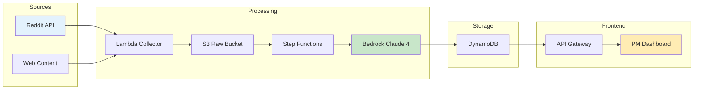

# Legal Community Feedback Collector & Analyzer
## System Design Document

---

## 1. Executive Summary

A data collection and analysis pipeline for monitoring legal technology discussions across Reddit communities, providing insights into user feedback, pain points, and market requirements. The system collects posts and comments from targeted subreddits, analyzes sentiment and themes using LLMs, and presents insights through a web dashboard.

### Key Features
- Automated Reddit data collection from legal-focused subreddits
- AI-powered analysis for sentiment, topics, and requirement extraction
- Weekly automated collection with manual trigger capability
- Interactive visualization dashboard
- Cost-optimized serverless architecture

---

## 2. System Architecture

### 2.1 High-Level Architecture

```
┌─────────────────────────────────────────────────────────────┐
│                        User Interface                        │
│                   (Next.js on Cloudflare)                   │
└─────────────────┬───────────────────────┬───────────────────┘
                  │                       │
                  ▼                       ▼
┌─────────────────────────┐   ┌─────────────────────────────┐
│      API Gateway        │   │     Static Assets (CDN)     │
│   (Cloudflare Workers)  │   │    (Cloudflare Pages)       │
└────────────┬────────────┘   └─────────────────────────────┘
             │
             ▼
┌─────────────────────────────────────────────────────────────┐
│                    Data Processing Layer                     │
│  ┌──────────────┐  ┌──────────────┐  ┌──────────────────┐ │
│  │   Collector  │→ │   Analyzer   │→ │   Aggregator     │ │
│  │ (Lambda/ECS) │  │ (Step Func)  │  │  (Lambda)        │ │
│  └──────────────┘  └──────────────┘  └──────────────────┘ │
└─────────────────────────────────────────────────────────────┘
             │                 │                 │
             ▼                 ▼                 ▼
┌─────────────────────────────────────────────────────────────┐
│                      Storage Layer                           │
│  ┌──────────────┐  ┌──────────────┐  ┌──────────────────┐ │
│  │  Raw Data    │  │ Processed    │  │   Aggregated     │ │
│  │  (S3)        │  │ Data (DDB)   │  │   Data (DDB)     │ │
│  └──────────────┘  └──────────────┘  └──────────────────┘ │
└─────────────────────────────────────────────────────────────┘
```

### 2.2 Technology Stack

| Component | Technology | Rationale |
|-----------|------------|-----------|
| **Frontend** | Next.js 14 (App Router) | React-based, SSR/SSG support, excellent DX |
| **Hosting** | Cloudflare Pages | Edge deployment, free tier, global CDN |
| **API Layer** | Cloudflare Workers | Serverless, edge computing, cost-effective |
| **Data Collection** | AWS Lambda | Serverless, pay-per-use, easy scheduling |
| **Orchestration** | AWS Step Functions | State management, error handling, retries |
| **LLM Processing** | Amazon Bedrock (Claude Sonnet 4) | Superior capability, no infrastructure, pay-per-token |
| **Primary Storage** | AWS S3 | Cheap object storage for raw data |
| **Primary Database** | DynamoDB | Serverless NoSQL, auto-scaling, time-series optimized |
| **Scheduling** | EventBridge | Weekly cron trigger for collection |
| **Monitoring** | CloudWatch | Built-in AWS metrics and logging |

---

## 3. Data Collection Pipeline

### 3.1 Data Sources

**Primary Sources:**
- **Reddit API:** User feedback, pain points, feature requests
- **Web Content:** Competitor websites, whitepapers, documentation, blog posts

**Target Content:**
- Reddit discussions from r/LawFirm, r/Lawyertalk, r/legaltech, r/legaltechAI
- Competitor product pages and documentation
- Industry reports and whitepapers
- Legal tech blog posts and news

**Search Keywords:**
- Product names: "Supio", "Harvey", "Casetext", "Lexis+", "Westlaw"
- General topics: "automation", "AI lawyer", "document review", "contract analysis"

### 3.2 Collection Strategy

```python
# Simple Collection Configuration
{
  "reddit": {
    "schedule": "cron(0 2 ? * MON *)",  # Weekly on Monday 2 AM UTC
    "lookback_days": 7,
    "min_score": 10,  # Filter noise
    "subreddits": ["legaltech", "LawFirm", "Lawyertalk"]
  },
  "web_content": {
    "schedule": "on_demand",  # Triggered manually when needed
    "types": ["competitor_updates", "whitepapers", "blog_posts"],
    "rate_limit": 1  # 1 request per second
  },
  "processing": {
    "priority_threshold": 5,  # Only store priority >= 5
    "alert_threshold": 8,     # Alert PM for priority >= 8
    "ttl_days": 90
  }
}
```

### 3.3 Simplified Data Schema

```typescript
// Raw data stored in S3 (any source)
interface RawContent {
  id: string;
  source_type: string;    // "reddit" or "web"
  url: string;
  collected_at: number;
  raw_content: any;       // Original JSON/HTML/text
}

// Processed insight stored in DynamoDB (unified)
interface ProcessedInsight {
  // Identifiers
  post_id: string;
  source_url: string;
  timestamp: number;
  
  // PM focus
  feature_summary: string;       // One-line description
  feature_category: string;      // document_automation, ai_accuracy, integration, workflow  
  priority_score: number;         // 1-10 (only store 5+)
  user_segment: string;          // solo, small_firm, enterprise
  
  // Competition
  competitors_mentioned: string[];  // ["Harvey", "Casetext"]
  supio_mentioned: boolean;
  
  // Action
  action_required: boolean;      // Priority >= 8
  suggested_action: string;      // "Add to roadmap", "Research"
}
```

---

## 4. Data Processing & Analysis

### 4.1 Simplified Processing Pipeline



### 4.2 LLM Analysis Prompts

**Supio-Focused Feature Discovery:**
```
As a product analyst for Supio (AI legal automation platform), analyze this post to identify:

1. FEATURE GAPS: What specific capabilities are users asking for that Supio could build?
   - Document automation needs (intake, discovery, drafting)
   - AI accuracy concerns and trust barriers
   - Integration requirements with existing tools
   - Workflow automation pain points

2. COMPETITIVE INTELLIGENCE: How do users perceive Supio vs competitors?
   - Harvey, Casetext, Lexis+ AI, Westlaw Edge mentions
   - Price sensitivity and value perception
   - Switching barriers from current solutions

3. USER SEGMENTS: Which type of legal professional is this?
   - Solo practitioner / Small firm (1-10 attorneys)
   - Mid-market (11-50 attorneys)  
   - Large firm (50+ attorneys)
   - In-house legal department

Return priority score (1-10) for product roadmap consideration.
```

**Pain Point to Product Feature Mapping:**
```
Analyze this legal professional's workflow challenge and suggest how Supio could address it:

1. CURRENT PAIN: What manual/inefficient process are they describing?
2. SUPIO SOLUTION: Specific feature that could automate/improve this
3. IMPLEMENTATION COMPLEXITY: Simple config, new feature, or platform change
4. MARKET DEMAND: Is this a one-off request or common pattern?
5. ROI POTENTIAL: Time saved, error reduction, or revenue impact

Prioritize for: Quick wins, Strategic features, or Future consideration
```

**AI Adoption Readiness Assessment:**
```
Evaluate this legal professional's readiness for AI-powered tools like Supio:

1. TECH MATURITY: Current tool usage and digital sophistication
2. AI PERCEPTION: Enthusiastic, cautious, skeptical, or hostile
3. DECISION FACTORS: 
   - Primary concern: accuracy, security, cost, or ease-of-use
   - Success metrics they care about
4. ONBOARDING NEEDS: Training, proof-of-concept, or peer validation required
5. EXPANSION POTENTIAL: Single use case or platform-wide adoption likely

Recommend: Sales approach, feature emphasis, and support level needed
```

**Web Content Analysis (Competitor Sites, Whitepapers, etc.):**
```
Analyze this web content for Supio product insights:

URL: {url}
Content Type: {type} (competitor_site, whitepaper, blog_post)

Extract:
1. Key features or capabilities mentioned
2. Pricing information if available
3. Customer segments targeted
4. Competitive advantages claimed
5. Integration partnerships mentioned

For Supio PM:
- Feature gaps to exploit
- Positioning opportunities
- Priority: 1-10
- Suggested action
```

### 4.3 DynamoDB Schema & Usage

#### Simplified Table Design

```typescript
// Table: supio_insights
// Purpose: Store actionable product insights from Reddit for PM decision-making
{
  // Primary Key Design (simple time-series access)
  PK: "INSIGHT#{YYYY-MM-DD}",  // Daily partitioning for recent data access
  SK: "PRIORITY#{score}#ID#{post_id}",  // Sort by priority for PM review
  
  // Core Attributes (what PMs actually need)
  post_id: string,              // Reddit post ID for reference
  timestamp: number,            // When collected
  subreddit: string,            // Source community
  post_url: string,             // Direct link to Reddit discussion
  ttl: number,                  // Auto-expire after 90 days
  
  // User Context
  user_segment: string,         // solo, small_firm, enterprise
  
  // Feature Request (main PM focus)
  feature_summary: string,      // One-line description for PM dashboard
  feature_details: string,      // Full extracted requirement
  feature_category: string,     // document_automation, ai_accuracy, integration, workflow
  priority_score: number,       // 1-10 for roadmap prioritization
  implementation_size: string,  // small, medium, large
  
  // Competitive Context (market intelligence)
  competitors_mentioned: string[],  // ["Harvey", "Casetext", etc.]
  supio_mentioned: boolean,        // Direct Supio feedback
  competitive_advantage: string,    // How this feature helps vs competitors
  
  // Action Items (what PM should do)
  action_required: boolean,     // Needs immediate PM review
  suggested_action: string,     // "Add to roadmap", "Contact user", "Research further"
  potential_revenue: string,    // Rough estimate if available
}

// Single GSI for priority access (most important for PMs)
GSI1: {
  PK: "PRIORITY",  // Fixed value for all high-priority items
  SK: "SCORE#{priority_score}#DATE#{YYYY-MM-DD}",  // Sort by priority then date
  // This GSI lets PMs quickly query: "Show me all priority 8+ items from last week"
}
```

#### PM-Focused Query Patterns

```python
# 1. Daily PM Review - "What should I look at today?"
def get_todays_priorities(min_priority=7):
    """Get today's high-priority insights for PM morning review"""
    today = datetime.now().strftime('%Y-%m-%d')
    response = table.query(
        KeyConditionExpression="PK = :pk AND begins_with(SK, :priority)",
        ExpressionAttributeValues={
            ":pk": f"INSIGHT#{today}",
            ":priority": f"PRIORITY#{min_priority}"  # Only 7+ priority items
        },
        ScanIndexForward=False  # Highest priority first
    )
    return response['Items']

# 2. Weekly Feature Requests - "What features are users asking for?"
def get_weekly_feature_requests():
    """Get all feature requests from past 7 days, sorted by priority"""
    response = table.query(
        IndexName="GSI1",
        KeyConditionExpression="PK = :pk AND SK > :sk",
        ExpressionAttributeValues={
            ":pk": "PRIORITY",
            ":sk": f"SCORE#7#DATE#{seven_days_ago}"  # Priority 7+ from last week
        },
        ScanIndexForward=False,  # Highest priority first
        FilterExpression="action_required = :true",
        ExpressionAttributeValues={":true": True}
    )
    return response['Items']

# 3. Competitive Intelligence - "What are users saying about competitors?"
def get_competitor_mentions(competitor_name):
    """Filter for posts mentioning specific competitors"""
    # Note: This uses a filter on the main query since we simplified GSIs
    response = table.scan(
        FilterExpression="contains(competitors_mentioned, :competitor)",
        ExpressionAttributeValues={
            ":competitor": competitor_name
        },
        Limit=50  # Recent 50 mentions
    )
    return response['Items']

# 4. Direct Supio Feedback - "What do users say about us?"
def get_supio_feedback():
    """Get posts that directly mention Supio"""
    response = table.scan(
        FilterExpression="supio_mentioned = :true",
        ExpressionAttributeValues={
            ":true": True
        }
    )
    return response['Items']
```

#### Simplified Data Pipeline

```python
# Focus on getting actionable insights to PMs quickly, not complex aggregations

def process_content(content, source_type):
    """Unified pipeline: Any Source → S3 → LLM → DynamoDB → Dashboard"""
    
    # 1. Store raw content in S3 (single bucket)
    s3_key = f"{source_type}/{datetime.now().strftime('%Y-%m-%d')}/{content['id']}.json"
    s3.put_object(
        Bucket='supio-raw-data',
        Key=s3_key,
        Body=json.dumps(content)
    )
    
    # 2. Analyze with Claude Sonnet 4
    analysis = bedrock.analyze_content(content, source_type)
    
    # 3. Store insights if relevant (priority >= 5)
    if analysis['priority_score'] >= 5:
        item = {
            'PK': f"INSIGHT#{datetime.now().strftime('%Y-%m-%d')}",
            'SK': f"PRIORITY#{analysis['priority_score']}#ID#{content['id']}",
            'post_id': content['id'],
            'source_url': content['url'],
            'timestamp': int(time.time()),
            'ttl': int(time.time()) + (90 * 24 * 60 * 60),
            
            # Unified PM data
            'feature_summary': analysis['feature_summary'],
            'feature_category': analysis['feature_category'],
            'priority_score': analysis['priority_score'],
            'user_segment': analysis.get('user_segment', 'unknown'),
            'competitors_mentioned': analysis.get('competitors', []),
            'action_required': analysis['priority_score'] >= 8,
            'suggested_action': analysis['suggested_action']
        }
        
        table.put_item(Item=item)
        
        # 4. Alert if critical
        if analysis['priority_score'] >= 9:
            send_slack_alert(f"🚨 High Priority: {analysis['feature_summary']}")
    
    return analysis

# Simple weekly summary for PMs (no complex aggregations needed)
def generate_weekly_summary():
    """Create simple weekly summary email for product team"""
    
    # Get this week's insights
    insights = get_weekly_feature_requests()
    
    # Group by category (simple Python, not complex DDB aggregations)
    by_category = {}
    for item in insights:
        cat = item['feature_category']
        if cat not in by_category:
            by_category[cat] = []
        by_category[cat].append(item)
    
    # Format simple email
    email_body = f"""
    Weekly Product Insights - {datetime.now().strftime('%Y-%m-%d')}
    
    Total Feature Requests: {len(insights)}
    High Priority (8+): {sum(1 for i in insights if i['priority_score'] >= 8)}
    
    Top Features by Category:
    {format_features_by_category(by_category)}
    
    Direct Links to Review:
    {format_reddit_links(insights[:10])}  # Top 10 only
    """
    
    send_email_to_pm_team(email_body)
```

---

## 5. Frontend Application

### 5.1 Next.js Architecture

```
/app
├── layout.tsx          # Root layout with providers
├── page.tsx           # Landing dashboard
├── api/
│   ├── data/route.ts  # Data fetching endpoints
│   └── trigger/route.ts # Manual trigger endpoint
├── dashboard/
│   ├── page.tsx       # Main dashboard
│   ├── insights/page.tsx
│   └── trends/page.tsx
└── components/
    ├── charts/        # Recharts components
    ├── filters/       # Data filtering UI
    └── cards/         # Metric cards
```

### 5.2 Key Features

1. **Product Intelligence Dashboard**
   - Feature request heat map with priority scoring
   - Competitive positioning matrix (Supio vs competitors)
   - User segment distribution and AI readiness gauge
   - Pain point to solution mapping visualization
   - Weekly PM action items with direct Reddit links

2. **Feature Discovery Explorer**
   - Searchable feature request database with priority filters
   - Competitor mention timeline with sentiment analysis
   - User journey pain point mapping
   - Integration requirement tracker
   - Export capabilities for product roadmap planning (CSV, JSON, JIRA)

3. **Smart Alert System**
   - High-priority feature requests (auto-create JIRA tickets)
   - Competitor win/loss notifications
   - Enterprise user pain points requiring immediate attention
   - AI adoption barriers that need addressing
   - Weekly digest for product team standup

### 5.3 Cloudflare Workers API

```typescript
// workers/api/index.ts
export default {
  async fetch(request: Request, env: Env) {
    const url = new URL(request.url);
    
    // CORS headers
    const headers = {
      'Access-Control-Allow-Origin': '*',
      'Content-Type': 'application/json',
    };

    // Route handling
    if (url.pathname === '/api/insights') {
      return handleInsights(request, env, headers);
    }
    
    if (url.pathname === '/api/trigger') {
      return handleManualTrigger(request, env, headers);
    }
    
    return new Response('Not Found', { status: 404 });
  }
};
```

---

## 6. Infrastructure as Code

### 6.1 AWS CDK Stack

```typescript
// infrastructure/stack.ts
export class LegalCrawlerStack extends Stack {
  constructor(scope: Construct, id: string) {
    super(scope, id);

    // S3 Buckets
    const rawDataBucket = new Bucket(this, 'RawData', {
      lifecycleRules: [{
        expiration: Duration.days(90),
        transitions: [{
          storageClass: StorageClass.GLACIER_INSTANT_RETRIEVAL,
          transitionAfter: Duration.days(30),
        }]
      }]
    });

    // Simplified DynamoDB Table for PM insights
    const insightsTable = new Table(this, 'SupioInsights', {
      tableName: 'supio-insights',
      partitionKey: { name: 'PK', type: AttributeType.STRING },
      sortKey: { name: 'SK', type: AttributeType.STRING },
      billingMode: BillingMode.PAY_PER_REQUEST,  // Cost-effective for prototype
      timeToLiveAttribute: 'ttl',  // Auto-cleanup after 90 days
      
      // Single GSI for priority queries
      globalSecondaryIndexes: [{
        indexName: 'GSI1',
        partitionKey: { name: 'GSI1PK', type: AttributeType.STRING },
        sortKey: { name: 'GSI1SK', type: AttributeType.STRING },
      }]
    });

    // Lambda Functions
    const collector = new Function(this, 'Collector', {
      runtime: Runtime.PYTHON_3_11,
      handler: 'collector.handler',
      timeout: Duration.minutes(15),
      memorySize: 1024,
      environment: {
        BUCKET_NAME: rawDataBucket.bucketName,
        REDDIT_CLIENT_ID: process.env.REDDIT_CLIENT_ID!,
        REDDIT_SECRET: process.env.REDDIT_SECRET!,
      }
    });

    // Simplified Step Functions for batch processing
    const processingStateMachine = new StateMachine(this, 'RedditInsightsPipeline', {
      definition: new Chain()
        .start(new LambdaInvoke(this, 'CollectPosts', {
          lambdaFunction: collector,
          outputPath: '$.Payload'
        }))
        .next(new LambdaInvoke(this, 'AnalyzePosts', {
          lambdaFunction: analyzer,
          outputPath: '$.Payload'
        }))
        .next(new LambdaInvoke(this, 'StoreInsights', {
          lambdaFunction: storer,
          outputPath: '$.Payload'
        })),
      timeout: Duration.hours(1),  // Reduced from 2 hours
    });

    // EventBridge Rule - Only scheduling component needed
    new Rule(this, 'WeeklyRedditCollection', {
      ruleName: 'supio-weekly-reddit-insights',
      description: 'Trigger Reddit collection every Monday morning',
      schedule: Schedule.cron({ 
        minute: '0',
        hour: '2',
        weekDay: 'MON'  // Weekly collection
      }),
      targets: [new SfnStateMachine(processingStateMachine)],
    });
  }
}
```

---

## 7. Cost Optimization Strategies

### 7.1 Estimated Monthly Costs

| Service | Usage | Cost |
|---------|-------|------|
| **Cloudflare Pages** | < 500k requests | $0 (free tier) |
| **Cloudflare Workers** | < 100k requests | $0 (free tier) |
| **AWS Lambda** | ~150 invocations/month | ~$1.50 |
| **Amazon Bedrock** | ~50k tokens/month with prompt caching | ~$9 |
| **DynamoDB** | < 500MB, on-demand, 1 GSI | ~$3 |
| **S3** | < 5GB (single raw data bucket) | ~$0.15 |
| **Step Functions** | ~4 state machine executions | ~$0.10 |
| **EventBridge** | 1 scheduled rule/month | ~$0 |
| **Total** | | **~$14/month** |

### 7.2 Simple Cost Optimizations

1. **Smart Filtering**
   - Only process posts with 10+ upvotes (reduces noise)
   - Skip posts older than 7 days (focus on recent feedback)
   - Filter out off-topic subreddits dynamically

2. **LLM Cost Reduction**
   - AWS Bedrock prompt caching (60% cost reduction)
   - Batch similar posts together
   - Only analyze comments if post priority > 6

3. **Storage Efficiency**
   - TTL on all DynamoDB items (90 days)
   - Store only actionable insights (priority 5+)
   - Link to Reddit instead of storing full content

---

## 10. Development & Deployment

### 10.1 Development Workflow

```bash
# Local Development
npm run dev           # Next.js dev server
npm run worker:dev    # Wrangler for Workers
npx cdk synth            # Check CDK synthesis

# Testing
npm test             # Unit tests
npm run test:load    # K6 load testing

# Deployment
npm run build        # Build Next.js
wrangler publish     # Deploy Workers
npx cdk deploy          # Deploy AWS infrastructure
```

### 10.2 CI/CD Pipeline

```yaml
# .github/workflows/deploy.yml
name: Deploy
on:
  push:
    branches: [main]
    
jobs:
  deploy-frontend:
    runs-on: ubuntu-latest
    steps:
      - uses: actions/checkout@v3
      - name: Deploy to Cloudflare Pages
        uses: cloudflare/pages-action@v1
        with:
          apiToken: ${{ secrets.CF_API_TOKEN }}
          projectName: legal-crawler
          
  deploy-backend:
    runs-on: ubuntu-latest
    steps:
      - uses: aws-actions/configure-aws-credentials@v2
      - name: Deploy CDK Stack
        run: npx cdk deploy --require-approval never
```

---

## 11. Future Enhancements

### Phase 2 (Q2 2025)
- Expand to LinkedIn and Twitter/X monitoring
- Multi-language support for international markets
- Custom ML models for legal-specific NER
- Real-time streaming with Kinesis

### Phase 3 (Q3 2025)
- Competitor pricing analysis from public sources
- Integration with CRM systems (Salesforce, HubSpot)
- Predictive analytics for market trends
- White-label solution for law firms

---

## Appendix A: Reddit API Integration

### Reddit API Schema

```python
# PRAW Authentication & Initialization
import praw
from typing import List, Dict, Optional
import os
from datetime import datetime, timedelta

class RedditCollector:
    def __init__(self):
        """Initialize PRAW Reddit client with OAuth2 authentication"""
        self.client = praw.Reddit(
            client_id=os.environ['REDDIT_CLIENT_ID'],
            client_secret=os.environ['REDDIT_SECRET'],
            user_agent='legal-crawler/1.0 (by u/YOUR_USERNAME)',
            username=os.environ.get('REDDIT_USERNAME'),  # Optional for read-only
            password=os.environ.get('REDDIT_PASSWORD')   # Optional for read-only
        )
        self.client.read_only = True  # Enable read-only mode for better rate limits
    
    def collect_subreddit_posts(
        self, 
        subreddit_names: List[str], 
        keywords: List[str],
        time_filter: str = 'week',
        limit: int = 100
    ) -> List[Dict]:
        """Collect posts from multiple subreddits with keyword search"""
        all_posts = []
        
        for subreddit_name in subreddit_names:
            subreddit = self.client.subreddit(subreddit_name)
            
            # Search posts by keywords
            for keyword in keywords:
                try:
                    for submission in subreddit.search(
                        query=keyword, 
                        time_filter=time_filter,
                        limit=limit,
                        sort='relevance'
                    ):
                        post_data = self._extract_post_data(submission)
                        if post_data not in all_posts:  # Avoid duplicates
                            all_posts.append(post_data)
                except Exception as e:
                    print(f"Error searching {keyword} in r/{subreddit_name}: {e}")
            
            # Also get recent hot, new, and rising posts
            for listing_type in ['hot', 'new', 'rising']:
                try:
                    listing_func = getattr(subreddit, listing_type)
                    for submission in listing_func(limit=25):
                        if self._is_relevant(submission, keywords):
                            post_data = self._extract_post_data(submission)
                            if post_data not in all_posts:
                                all_posts.append(post_data)
                except Exception as e:
                    print(f"Error fetching {listing_type} from r/{subreddit_name}: {e}")
        
        return all_posts
    
    def _extract_post_data(self, submission) -> Dict:
        """Extract relevant data from a Reddit submission object"""
        # Fetch comments (limit to top 20 for efficiency)
        submission.comments.replace_more(limit=0)  # Remove MoreComments objects
        comments = submission.comments.list()[:20]
        
        return {
            'id': submission.id,
            'subreddit': submission.subreddit.display_name,
            'title': submission.title,
            'content': submission.selftext,
            'author': str(submission.author) if submission.author else '[deleted]',
            'created_utc': int(submission.created_utc),
            'score': submission.score,
            'upvote_ratio': submission.upvote_ratio,
            'num_comments': submission.num_comments,
            'url': f"https://reddit.com{submission.permalink}",
            'flair': submission.link_flair_text,
            'is_video': submission.is_video,
            'comments': [
                {
                    'id': comment.id,
                    'author': str(comment.author) if comment.author else '[deleted]',
                    'body': comment.body,
                    'score': comment.score,
                    'created_utc': int(comment.created_utc),
                    'is_op': comment.is_submitter
                }
                for comment in comments
            ],
            'collected_at': datetime.utcnow().isoformat()
        }
    
    def _is_relevant(self, submission, keywords: List[str]) -> bool:
        """Check if a submission is relevant based on keywords"""
        text_to_check = f"{submission.title} {submission.selftext}".lower()
        return any(keyword.lower() in text_to_check for keyword in keywords)
    
    def stream_subreddit_comments(self, subreddit_name: str, skip_existing: bool = True):
        """Stream real-time comments from a subreddit"""
        subreddit = self.client.subreddit(subreddit_name)
        for comment in subreddit.stream.comments(skip_existing=skip_existing):
            yield {
                'id': comment.id,
                'submission_id': comment.submission.id,
                'author': str(comment.author) if comment.author else '[deleted]',
                'body': comment.body,
                'score': comment.score,
                'created_utc': int(comment.created_utc),
                'subreddit': comment.subreddit.display_name,
                'permalink': f"https://reddit.com{comment.permalink}"
            }
```

### Rate Limiting & Best Practices

```python
# Reddit API Rate Limits (PRAW handles automatically)
RATE_LIMITS = {
    'authenticated': 600,  # requests per 10 minutes
    'unauthenticated': 60,  # requests per 10 minutes
    'search': 25,  # searches per minute
    'listing': 100  # max items per request
}

# Implement exponential backoff for resilience
import time
from functools import wraps

def with_retry(max_attempts: int = 3, backoff_factor: float = 2.0):
    def decorator(func):
        @wraps(func)
        def wrapper(*args, **kwargs):
            for attempt in range(max_attempts):
                try:
                    return func(*args, **kwargs)
                except praw.exceptions.APIException as e:
                    if attempt == max_attempts - 1:
                        raise
                    wait_time = backoff_factor ** attempt
                    print(f"API error, retrying in {wait_time}s: {e}")
                    time.sleep(wait_time)
                except praw.exceptions.RedditAPIException as e:
                    # Handle specific error codes
                    for subexception in e.items:
                        if subexception.error_type == 'RATELIMIT':
                            wait_time = int(subexception.message.split(' ')[-2]) * 60
                            print(f"Rate limited, waiting {wait_time}s")
                            time.sleep(wait_time)
                        else:
                            raise
            return None
        return wrapper
    return decorator
```

---

## Appendix B: LLM Processing with Claude Sonnet 4

```python
# bedrock_analyzer.py
import boto3
import json
from typing import Dict, Any, List
import logging
import time
from datetime import datetime

class BedrockAnalyzer:
    def __init__(self):
        """Initialize Bedrock client with Claude Sonnet 4"""
        self.client = boto3.client(
            'bedrock-runtime',
            region_name='us-east-1'  # Claude Sonnet 4 availability
        )
        # Claude Sonnet 4 model ID
        self.model_id = 'anthropic.claude-3-5-sonnet-20241022-v2:0'
        self.logger = logging.getLogger(__name__)
    
    def analyze_post(self, post: Dict[str, Any]) -> Dict[str, Any]:
        """Analyze a Reddit post using Claude Sonnet 4"""
        
        # Prepare context with post and top comments
        comments_text = "\n".join([
            f"- {c['author']} ({c['score']} points): {c['body'][:200]}"
            for c in post.get('comments', [])[:10]
        ])
        
        messages = [{
            "role": "user",
            "content": f"""
            Analyze this Reddit post from the legal technology community r/{post['subreddit']}.
            
            Post Title: {post['title']}
            Post Content: {post.get('content', 'No text content')}
            Post Score: {post['score']} points
            Number of Comments: {post['num_comments']}
            
            Top Comments:
            {comments_text}
            
            Analyze this post as a Supio product analyst to extract actionable insights:
            
            1. Feature Discovery:
               - Identify specific features users are requesting that Supio could build
               - Categorize: document_automation, ai_accuracy, integration, workflow, discovery_management
               - Assign priority score (1-10) based on user pain level and market demand
               - Note if this is a quick_win, strategic_feature, or future_consideration
            
            2. Competitive Intelligence:
               - Identify mentions of competitors (Harvey, Casetext, Lexis+, Westlaw, others)
               - Assess sentiment toward each competitor (-1 to 1)
               - Extract specific strengths/weaknesses mentioned
               - Note if user is considering switching from/to any solution
            
            3. User Segmentation:
               - Identify user type: solo_practitioner, small_firm, mid_market, large_firm, in_house
               - Assess AI readiness: enthusiastic, cautious, skeptical, hostile
               - Note tech maturity level based on tools mentioned
               - Identify decision-making factors (cost, accuracy, security, ease_of_use)
            
            4. Pain Point Analysis:
               - Extract specific workflow inefficiencies or manual processes
               - Map each pain point to potential Supio solution
               - Assess implementation complexity: simple_config, new_feature, platform_change
               - Estimate ROI potential: hours_saved_weekly, error_reduction_percentage
            
            5. Action Items for PM:
               - Flag if immediate PM review needed (true/false)
               - Suggest specific product roadmap items
               - Identify potential beta testing candidates
               - Note any urgent competitive threats
            
            Return your analysis as a valid JSON object.
            """
        }]
        
        try:
            response = self.client.invoke_model(
                modelId=self.model_id,
                body=json.dumps({
                    "anthropic_version": "bedrock-2023-05-31",
                    "max_tokens": 1000,
                    "messages": messages,
                    "temperature": 0.3,  # Lower temperature for consistent analysis
                    "top_p": 0.9
                })
            )
            
            response_body = json.loads(response['body'].read())
            content = response_body['content'][0]['text']
            
            # Parse the JSON response
            analysis = json.loads(content)
            
            # Add metadata
            analysis['post_id'] = post['id']
            analysis['analyzed_at'] = datetime.utcnow().isoformat()
            analysis['model_used'] = self.model_id
            
            return analysis
            
        except Exception as e:
            self.logger.error(f"Error analyzing post {post['id']}: {e}")
            return {
                'post_id': post['id'],
                'error': str(e),
                'analyzed_at': datetime.utcnow().isoformat()
            }
    
    def batch_analyze(self, posts: List[Dict[str, Any]], batch_size: int = 10) -> List[Dict[str, Any]]:
        """Analyze multiple posts in batches for efficiency"""
        results = []
        
        for i in range(0, len(posts), batch_size):
            batch = posts[i:i + batch_size]
            for post in batch:
                result = self.analyze_post(post)
                results.append(result)
                
                # Add small delay to respect rate limits
                time.sleep(0.5)
        
        return results
    
    def extract_requirements(self, text: str) -> List[Dict[str, str]]:
        """Extract Supio-specific feature requirements and opportunities"""
        messages = [{
            "role": "user",
            "content": f"""
            As a Supio product analyst, extract actionable feature requirements from this text:
            
            {text}
            
            For each requirement found, provide:
            - requirement: Specific feature or capability needed
            - supio_approach: How Supio could uniquely solve this (leverage AI, automation, etc.)
            - category: document_automation, discovery_management, ai_assistance, integration, workflow_optimization
            - priority_score: 1-10 (based on pain level and frequency mentioned)
            - implementation_effort: small (1 sprint), medium (2-4 sprints), large (quarter+)
            - user_segment: solo, small_firm, mid_market, enterprise, in_house
            - competitive_advantage: How this helps Supio vs Harvey/Casetext/others
            - success_metric: How to measure if this feature succeeds
            
            Focus on requirements that align with Supio's legal AI automation mission.
            Return as a JSON array sorted by priority_score.
            """
        }]
        
        response = self.client.invoke_model(
            modelId=self.model_id,
            body=json.dumps({
                "anthropic_version": "bedrock-2023-05-31",
                "max_tokens": 500,
                "messages": messages,
                "temperature": 0.2
            })
        )
        
        response_body = json.loads(response['body'].read())
        return json.loads(response_body['content'][0]['text'])
```

### Cost Optimization with AWS Bedrock Prompt Caching

```python
# Use AWS Bedrock's native prompt caching to reduce costs
# Reference: https://docs.aws.amazon.com/bedrock/latest/userguide/prompt-caching.html

class OptimizedAnalyzer(BedrockAnalyzer):
    def __init__(self):
        super().__init__()
        # System prompt cached across multiple requests
        self.system_prompt = """You are an AI assistant analyzing Reddit posts from legal technology communities 
        to extract actionable insights for the Supio product team. Focus on identifying specific feature requests, 
        pain points, and competitive intelligence that can inform product development."""
    
    def analyze_post_batch(self, posts: List[Dict[str, Any]]) -> List[Dict[str, Any]]:
        """Analyze multiple posts using prompt caching for cost optimization"""
        
        # Create a cached system context that will be reused
        system_context = {
            "role": "system",
            "content": [
                {
                    "type": "text",
                    "text": self.system_prompt
                },
                {
                    "type": "text",
                    "text": """Analysis Framework:
                    1. Extract specific feature requests relevant to legal AI automation
                    2. Identify workflow pain points that Supio could address
                    3. Note competitor mentions and their perceived strengths/weaknesses
                    4. Assess market readiness for AI features
                    5. Capture integration requirements with existing legal tools
                    """,
                    "cache_control": {"type": "ephemeral"}  # Cache this portion
                }
            ]
        }
        
        results = []
        for post in posts:
            try:
                # User message varies per post (not cached)
                user_message = {
                    "role": "user",
                    "content": f"""Analyze this post:
                    Title: {post['title']}
                    Content: {post.get('content', 'N/A')}
                    Subreddit: r/{post['subreddit']}
                    Engagement: {post['score']} points, {post['num_comments']} comments
                    
                    Return structured JSON analysis."""
                }
                
                response = self.client.invoke_model(
                    modelId=self.model_id,
                    body=json.dumps({
                        "anthropic_version": "bedrock-2023-05-31",
                        "max_tokens": 800,
                        "messages": [system_context, user_message],
                        "temperature": 0.3,
                        "top_p": 0.9,
                        # Enable caching for system prompts
                        "cache_config": {
                            "cache_ttl_seconds": 3600,  # Cache for 1 hour
                            "max_cache_size": 100  # Cache up to 100 prompts
                        }
                    })
                )
                
                response_body = json.loads(response['body'].read())
                analysis = json.loads(response_body['content'][0]['text'])
                analysis['post_id'] = post['id']
                analysis['cache_hit'] = response_body.get('cache_hit', False)
                results.append(analysis)
                
            except Exception as e:
                self.logger.error(f"Error analyzing post {post['id']}: {e}")
                results.append({
                    'post_id': post['id'],
                    'error': str(e)
                })
            
            # Small delay between requests
            time.sleep(0.2)
        
        # Log cache performance
        cache_hits = sum(1 for r in results if r.get('cache_hit', False))
        self.logger.info(f"Prompt cache hit rate: {cache_hits}/{len(results)} ({cache_hits*100/len(results):.1f}%)")
        
        return results

# Cost Calculation Example:
# - First request with new system prompt: ~500 input tokens
# - Subsequent requests with cached prompt: ~200 input tokens only
# - Savings: 60% reduction in input token costs for cached requests
# - Monthly estimate: ~$9 instead of ~$15 for LLM processing
```

---

*Document Version: 1.0*  
*Last Updated: 2025-01-16*  
*Author: System Architecture Team*