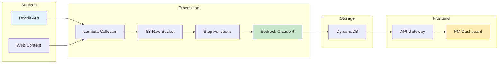

# Personal Injury Legal Intelligence Platform
## System Design Document

---

## 1. Executive Summary

A specialized data collection and analysis pipeline for monitoring personal injury (PI) law discussions across Reddit communities, focusing on medical records processing, demand letter automation, and PI attorney workflow optimization. The system collects posts and comments from PI-focused subreddits, analyzes insights using LLMs with emphasis on medical record handling pain points, and presents actionable intelligence through a web dashboard.

### Key Features
- **Multi-Platform Data Collection**: Automated collection from Reddit and X (Twitter)
- **Reddit Integration**: Personal injury law subreddits monitoring
- **X/Twitter Integration**: Real-time social media insights from legal tech discussions (NEW!)
- AI-powered analysis for PI-specific pain points (medical records, demand letters, settlement)
- Focus on competitors EvenUp and Eve in PI medical record processing space
- Weekly automated collection with manual trigger capability for both platforms
- Interactive visualization dashboard for PI attorney workflow insights
- Cost-optimized serverless architecture with unified data pipeline

---

## 2. System Architecture

### 2.1 High-Level Architecture

```
┌─────────────────────────────────────────────────────────────┐
│                        User Interface                       │
│                   (Next.js on Cloudflare)                   │
└─────────────────┬───────────────────────┬───────────────────┘
                  │                       │
                  ▼                       ▼
┌─────────────────────────┐   ┌─────────────────────────────┐
│      API Gateway        │   │     Static Assets (CDN)     │
│   (Cloudflare Workers)  │   │    (Cloudflare Pages)       │
└────────────┬────────────┘   └─────────────────────────────┘
             │
             ▼
┌─────────────────────────────────────────────────────────────┐
│                    Data Processing Layer                    │
│  ┌──────────────┐  ┌──────────────┐  ┌──────────────────┐   │
│  │   Collector  │→ │   Analyzer   │→ │   Aggregator     │   │
│  │ (Lambda/ECS) │  │ (Step Func)  │  │  (Lambda)        │   │
│  └──────────────┘  └──────────────┘  └──────────────────┘   │
└─────────────────────────────────────────────────────────────┘
             │                 │                 │
             ▼                 ▼                 ▼
┌─────────────────────────────────────────────────────────────┐
│                      Storage Layer                          |
│  ┌──────────────┐  ┌──────────────┐  ┌──────────────────┐   │
│  │  Raw Data    │  │ Processed    │  │   Aggregated     │   │
│  │  (S3)        │  │ Data (DDB)   │  │   Data (DDB)     │   │
│  └──────────────┘  └──────────────┘  └──────────────────┘   │
└─────────────────────────────────────────────────────────────┘
```

### 2.2 Technology Stack

| Component | Technology | Rationale |
|-----------|------------|-----------|
| **Frontend** | Next.js 15.0.0 (App Router) | React 19.1.0, SSR/SSG support, modern features |
| **Hosting** | Cloudflare Pages | Edge deployment with @cloudflare/next-on-pages adapter |
| **API Layer** | API Gateway + Lambda | REST API with 14 endpoints, API key authentication |
| **API Proxy** | Next.js API Routes | `/api/proxy` handles CORS and authentication |
| **Data Collection** | AWS Lambda (Python 3.12) | Serverless, pay-per-use, easy scheduling |
| **Orchestration** | AWS Step Functions | State management, error handling, retries |
| **LLM Processing** | Amazon Bedrock (Claude Sonnet 4) | Superior capability, no infrastructure, pay-per-token |
| **Primary Storage** | AWS S3 | Cheap object storage for raw data |
| **Primary Database** | DynamoDB | Two tables: supio-insights + supio-system-config |
| **Scheduling** | EventBridge | Weekly cron trigger (Monday 2 AM UTC) |
| **Monitoring** | CloudWatch | Built-in AWS metrics and logging |

---

## 3. Data Collection Pipeline

### 3.1 Data Sources

**Primary Sources:**
- **Reddit API:** PI attorney feedback, medical records pain points, demand letter challenges
- **X (Twitter) API v2:** Real-time legal tech discussions, PI attorney sentiment, product mentions (NEW!)
- **Web Content:** Competitor websites (EvenUp, Eve), PI law firm resources, medical-legal documentation

**Target Content - Reddit:**
- Reddit discussions from r/LawFirm, r/Lawyertalk, r/legaltech, r/legaltechAI
- PI-specific competitor product pages (EvenUp, Eve)
- Medical-legal integration resources
- PI law firm workflow and technology discussions

**Target Content - X/Twitter (NEW!):**
- Legal tech influencers and thought leaders
- PI attorney practice management discussions
- Product announcements and feature releases
- User testimonials and complaints
- Competitor mentions and comparisons
- Industry news and trends

**Search Keywords (Both Platforms):**
- Product names: "Supio", "EvenUp", "Eve"
- PI-specific topics: "medical records", "personal injury", "demand letter", "medical chronology", "settlement demand", "medical summary", "treatment timeline", "injury documentation", "medical bills", "case valuation"
- Legal tech hashtags: "#legaltech", "#lawfirm", "#PIlaw", "#legalAI"

### 3.2 Collection Strategy

```python
# Multi-Platform Collection Configuration
{
  "reddit": {
    "schedule": "cron(0 2 ? * MON *)",  # Weekly on Monday 2 AM UTC
    "lookback_days": 7,
    "min_score": 10,  # Filter noise
    "subreddits": ["LawFirm", "Lawyertalk", "legaltech", "legaltechAI"],
    "api_version": "PRAW",
    "rate_limit": "60 requests/minute"
  },
  "twitter": {  # NEW!
    "schedule": "cron(0 3 ? * MON *)",  # Weekly on Monday 3 AM UTC (after Reddit)
    "lookback_days": 7,
    "min_engagement": 5,  # Minimum likes + retweets
    "api_version": "v2",
    "search_queries": [
      "legaltech OR legal tech OR #legaltech",
      "personal injury attorney OR PI attorney",
      "Supio OR EvenUp OR Eve",
      "medical records processing",
      "demand letter automation"
    ],
    "user_lists": [
      "legal_tech_influencers",  # Curated list of thought leaders
      "pi_attorneys"             # PI attorney accounts
    ],
    "rate_limit": "300 tweets/15-min window",
    "max_tweets_per_query": 100
  },
  "web_content": {
    "schedule": "on_demand",  # Triggered manually when needed
    "types": ["competitor_updates", "pi_law_resources", "medical_legal_tech"],
    "rate_limit": 1  # 1 request per second
  },
  "processing": {
    "priority_threshold": 5,  # Only store priority >= 5
    "alert_threshold": 8,     # Alert PM for priority >= 8
    "ttl_days": 90,
    "focus_areas": ["medical_records_processing", "demand_letter_automation", "medical_chronology", "settlement_valuation"],
    "source_weighting": {  # NEW! Different weights by platform
      "reddit": 1.0,      # Base weight
      "twitter": 0.9,     # Slightly lower due to brevity
      "web": 0.8          # Lower for scraped content
    }
  }
}
```

### 3.3 Simplified Data Schema

```typescript
// Raw data stored in S3 (any source)
interface RawContent {
  id: string;
  source_type: string;    // "reddit", "twitter", or "web"
  source_platform: string; // NEW! More specific: "reddit_post", "twitter_tweet", "twitter_reply"
  url: string;
  collected_at: number;
  raw_content: any;       // Original JSON/HTML/text

  // Platform-specific metadata
  platform_metadata?: {
    // Twitter-specific
    tweet_id?: string;
    author_username?: string;
    author_verified?: boolean;
    engagement?: {
      likes: number;
      retweets: number;
      replies: number;
      quotes: number;
    };

    // Reddit-specific
    subreddit?: string;
    post_score?: number;
    num_comments?: number;
  };
}

// Processed insight stored in DynamoDB (unified)
interface ProcessedInsight {
  // Identifiers
  post_id: string;
  source_url: string;
  timestamp: number;
  
  // PM focus
  feature_summary: string;       // One-line description
  feature_category: string;      // medical_records_processing, demand_letter_automation, medical_chronology, settlement_valuation, case_management
  priority_score: number;         // 1-10 (only store 5+)
  user_segment: string;          // solo_pi_attorney, small_pi_firm, mid_size_pi_firm, large_pi_firm

  // Competition (PI-specific)
  competitors_mentioned: string[];  // ["EvenUp", "Eve"]
  supio_mentioned: boolean;
  
  // Action
  action_required: boolean;      // Priority >= 8
  suggested_action: string;      // "Add to roadmap", "Research"
}
```

---

## 4. Data Processing & Analysis

### 4.1 Simplified Processing Pipeline



### 4.2 LLM Analysis Prompts

**Supio-Focused PI Feature Discovery:**
```
As a product analyst for Supio (AI legal automation platform for personal injury law), analyze this post to identify:

1. PI-SPECIFIC FEATURE GAPS: What capabilities do PI attorneys need for medical record processing?
   - Medical records organization and chronology creation
   - Automated demand letter generation from medical documentation
   - Treatment timeline extraction from medical records
   - Medical bill summarization and cost calculation
   - Settlement valuation based on injury severity and treatment
   - Integration with medical providers and billing systems

2. COMPETITIVE INTELLIGENCE: How do users perceive Supio vs PI-focused competitors?
   - EvenUp, Eve mentions (medical records processing platforms)
   - Pain points with current medical record review workflows
   - Time spent on manual medical chronology creation
   - Demand letter drafting efficiency concerns
   - Accuracy of medical information extraction

3. USER SEGMENTS: Which type of PI legal professional is this?
   - Solo PI practitioner (1-2 attorneys, high volume motor vehicle accidents)
   - Small PI firm (3-10 attorneys, diverse injury cases)
   - Mid-size PI firm (11-50 attorneys, complex medical malpractice)
   - Large PI firm (50+ attorneys, mass torts and class actions)

4. MEDICAL RECORDS PAIN POINTS:
   - Volume of medical records per case (hundreds to thousands of pages)
   - Time required for medical chronology creation (8-20 hours per case)
   - Medical terminology comprehension challenges
   - Identifying causation between accident and treatment
   - Extracting key dates, procedures, and diagnoses
   - Organizing records from multiple providers

Return priority score (1-10) for product roadmap consideration with emphasis on medical workflow automation.
```

**PI Pain Point to Product Feature Mapping:**
```
Analyze this PI attorney's medical records workflow challenge and suggest how Supio could address it:

1. CURRENT PAIN: What manual medical records process are they describing?
   - Hours spent creating medical chronologies manually
   - Difficulty organizing records from multiple providers
   - Challenge understanding complex medical terminology
   - Time-consuming demand letter drafting with medical details
   - Manual calculation of medical expenses and future costs

2. SUPIO SOLUTION: Specific PI-focused feature that could automate/improve this
   - AI-powered medical chronology generation
   - Automated treatment timeline extraction
   - Medical terminology translation for legal professionals
   - Demand letter automation with medical narrative
   - Intelligent medical bill aggregation and cost projection

3. IMPLEMENTATION COMPLEXITY: Simple config, new feature, or platform change
4. MARKET DEMAND: Is this a one-off request or common pattern in PI practice?
5. ROI POTENTIAL: Time saved per case (medical chronology: 8-20 hours), error reduction in medical facts, faster settlement negotiations

Prioritize for: Quick wins (medical chronology), Strategic features (demand letter automation), or Future consideration
```

**PI Attorney AI Adoption Readiness Assessment:**
```
Evaluate this PI attorney's readiness for AI-powered medical records processing tools like Supio:

1. TECH MATURITY: Current case management and medical records tools
   - Using basic tools (Excel, Word) vs specialized PI software
   - Experience with medical records review software
   - Comfort level with AI-assisted legal tools

2. AI PERCEPTION: Enthusiastic, cautious, skeptical, or hostile toward AI medical analysis
   - Trust in AI accuracy for medical terminology extraction
   - Concerns about malpractice liability with AI-generated chronologies
   - Willingness to review AI-generated demand letters

3. DECISION FACTORS:
   - Primary concern: medical accuracy, HIPAA compliance, cost per case, time savings
   - Success metrics: hours saved per medical chronology, faster settlement times, increased case capacity
   - Integration with existing PI case management systems

4. ONBOARDING NEEDS: Training on medical AI features, proof-of-concept with sample case, or peer validation from other PI firms
5. EXPANSION POTENTIAL: Single use case (medical chronology only) vs full PI workflow adoption (chronology + demand letters + settlement valuation)

Recommend: Sales approach emphasizing medical accuracy validation, feature emphasis on time savings per case, and support level for medical terminology training
```

**PI Competitor Analysis (EvenUp, Eve, Medical Records Platforms):**
```
Analyze this web content for Supio PI product insights:

URL: {url}
Content Type: {type} (competitor_site, pi_resource, medical_legal_tech)
Competitor: {competitor_name} (EvenUp, Eve)

Extract:
1. Key medical records processing features (chronology, demand letters, medical summarization)
2. Pricing model (per case, subscription, or percentage of settlement)
3. PI attorney segments targeted (solo, small firm, high volume motor vehicle, complex medical malpractice)
4. Medical accuracy claims and validation methodology
5. Integration with PI case management systems
6. HIPAA compliance and data security features

For Supio PM:
- Feature gaps in medical records automation to exploit
- Positioning opportunities vs EvenUp/Eve
- PI-specific differentiation potential (medical terminology extraction, treatment causation analysis)
- Priority: 1-10 with emphasis on medical workflow impact
- Suggested action for PI market penetration
```

### 4.3 DynamoDB Schema & Usage

#### Simplified Table Design

```typescript
// Table: supio_insights
// Purpose: Store actionable product insights from Reddit for PM decision-making
{
  // Primary Key Design (simple time-series access)
  PK: "INSIGHT#{YYYY-MM-DD}",  // Daily partitioning for recent data access
  SK: "PRIORITY#{score}#ID#{post_id}",  // Sort by priority for PM review
  
  // Core Attributes (what PMs actually need)
  post_id: string,              // Reddit post ID for reference
  timestamp: number,            // When collected
  subreddit: string,            // Source community
  post_url: string,             // Direct link to Reddit discussion
  ttl: number,                  // Auto-expire after 90 days
  
  // PI User Context
  user_segment: string,         // solo_pi_attorney, small_pi_firm, mid_size_pi_firm, large_pi_firm

  // PI Feature Request (main PM focus)
  feature_summary: string,      // One-line description for PM dashboard
  feature_details: string,      // Full extracted requirement
  feature_category: string,     // medical_records_processing, demand_letter_automation, medical_chronology, settlement_valuation, case_management
  priority_score: number,       // 1-10 for roadmap prioritization
  implementation_size: string,  // small, medium, large

  // PI Competitive Context (market intelligence)
  competitors_mentioned: string[],  // ["EvenUp", "Eve"]
  supio_mentioned: boolean,        // Direct Supio feedback
  competitive_advantage: string,    // How this feature helps vs EvenUp/Eve in medical records processing
  
  // Action Items (what PM should do)
  action_required: boolean,     // Needs immediate PM review
  suggested_action: string,     // "Add to roadmap", "Contact user", "Research further"
  potential_revenue: string,    // Rough estimate if available
}

// Single GSI for priority access (most important for PMs)
GSI1: {
  PK: "PRIORITY",  // Fixed value for all high-priority items
  SK: "SCORE#{priority_score}#DATE#{YYYY-MM-DD}",  // Sort by priority then date
  // This GSI lets PMs quickly query: "Show me all priority 8+ items from last week"
}
```

#### PM-Focused Query Patterns

```python
# 1. Daily PM Review - "What should I look at today?"
def get_todays_priorities(min_priority=7):
    """Get today's high-priority insights for PM morning review"""
    today = datetime.now().strftime('%Y-%m-%d')
    response = table.query(
        KeyConditionExpression="PK = :pk AND begins_with(SK, :priority)",
        ExpressionAttributeValues={
            ":pk": f"INSIGHT#{today}",
            ":priority": f"PRIORITY#{min_priority}"  # Only 7+ priority items
        },
        ScanIndexForward=False  # Highest priority first
    )
    return response['Items']

# 2. Weekly Feature Requests - "What features are users asking for?"
def get_weekly_feature_requests():
    """Get all feature requests from past 7 days, sorted by priority"""
    response = table.query(
        IndexName="GSI1",
        KeyConditionExpression="PK = :pk AND SK > :sk",
        ExpressionAttributeValues={
            ":pk": "PRIORITY",
            ":sk": f"SCORE#7#DATE#{seven_days_ago}"  # Priority 7+ from last week
        },
        ScanIndexForward=False,  # Highest priority first
        FilterExpression="action_required = :true",
        ExpressionAttributeValues={":true": True}
    )
    return response['Items']

# 3. Competitive Intelligence - "What are users saying about competitors?"
def get_competitor_mentions(competitor_name):
    """Filter for posts mentioning specific competitors"""
    # Note: This uses a filter on the main query since we simplified GSIs
    response = table.scan(
        FilterExpression="contains(competitors_mentioned, :competitor)",
        ExpressionAttributeValues={
            ":competitor": competitor_name
        },
        Limit=50  # Recent 50 mentions
    )
    return response['Items']

# 4. Direct Supio Feedback - "What do users say about us?"
def get_supio_feedback():
    """Get posts that directly mention Supio"""
    response = table.scan(
        FilterExpression="supio_mentioned = :true",
        ExpressionAttributeValues={
            ":true": True
        }
    )
    return response['Items']
```

#### Simplified Data Pipeline

```python
# Focus on getting actionable insights to PMs quickly, not complex aggregations

def process_content(content, source_type):
    """Unified pipeline: Any Source → S3 → LLM → DynamoDB → Dashboard"""
    
    # 1. Store raw content in S3 (single bucket)
    s3_key = f"{source_type}/{datetime.now().strftime('%Y-%m-%d')}/{content['id']}.json"
    s3.put_object(
        Bucket='supio-raw-data',
        Key=s3_key,
        Body=json.dumps(content)
    )
    
    # 2. Analyze with Claude Sonnet 4
    analysis = bedrock.analyze_content(content, source_type)
    
    # 3. Store insights if relevant (priority >= 5)
    if analysis['priority_score'] >= 5:
        item = {
            'PK': f"INSIGHT#{datetime.now().strftime('%Y-%m-%d')}",
            'SK': f"PRIORITY#{analysis['priority_score']}#ID#{content['id']}",
            'post_id': content['id'],
            'source_url': content['url'],
            'timestamp': int(time.time()),
            'ttl': int(time.time()) + (90 * 24 * 60 * 60),
            
            # Unified PM data
            'feature_summary': analysis['feature_summary'],
            'feature_category': analysis['feature_category'],
            'priority_score': analysis['priority_score'],
            'user_segment': analysis.get('user_segment', 'unknown'),
            'competitors_mentioned': analysis.get('competitors', []),
            'action_required': analysis['priority_score'] >= 8,
            'suggested_action': analysis['suggested_action']
        }
        
        table.put_item(Item=item)
        
        # 4. Alert if critical
        if analysis['priority_score'] >= 9:
            send_slack_alert(f"🚨 High Priority: {analysis['feature_summary']}")
    
    return analysis

# Simple weekly summary for PMs (no complex aggregations needed)
def generate_weekly_summary():
    """Create simple weekly summary email for product team"""
    
    # Get this week's insights
    insights = get_weekly_feature_requests()
    
    # Group by category (simple Python, not complex DDB aggregations)
    by_category = {}
    for item in insights:
        cat = item['feature_category']
        if cat not in by_category:
            by_category[cat] = []
        by_category[cat].append(item)
    
    # Format simple email
    email_body = f"""
    Weekly Product Insights - {datetime.now().strftime('%Y-%m-%d')}
    
    Total Feature Requests: {len(insights)}
    High Priority (8+): {sum(1 for i in insights if i['priority_score'] >= 8)}
    
    Top Features by Category:
    {format_features_by_category(by_category)}
    
    Direct Links to Review:
    {format_reddit_links(insights[:10])}  # Top 10 only
    """
    
    send_email_to_pm_team(email_body)
```

---

## 5. Frontend Application

### 5.1 Next.js Architecture

```
/app
├── layout.tsx          # Root layout with providers
├── page.tsx           # Landing dashboard
├── api/
│   ├── data/route.ts  # Data fetching endpoints
│   └── trigger/route.ts # Manual trigger endpoint
├── dashboard/
│   ├── page.tsx       # Main dashboard
│   ├── insights/page.tsx
│   └── trends/page.tsx
└── components/
    ├── charts/        # Recharts components
    ├── filters/       # Data filtering UI
    └── cards/         # Metric cards
```

### 5.2 Key Features

1. **Product Intelligence Dashboard**
   - Feature request heat map with priority scoring
   - Competitive positioning matrix (Supio vs competitors)
   - User segment distribution and AI readiness gauge
   - Pain point to solution mapping visualization
   - Weekly PM action items with direct Reddit links

2. **Feature Discovery Explorer**
   - Searchable feature request database with priority filters
   - Competitor mention timeline with sentiment analysis
   - User journey pain point mapping
   - Integration requirement tracker
   - Export capabilities for product roadmap planning (CSV, JSON, JIRA)

3. **Smart Alert System**
   - High-priority feature requests (auto-create JIRA tickets)
   - Competitor win/loss notifications
   - Enterprise user pain points requiring immediate attention
   - AI adoption barriers that need addressing
   - Weekly digest for product team standup

### 5.3 Cloudflare Workers API

```typescript
// workers/api/index.ts
export default {
  async fetch(request: Request, env: Env) {
    const url = new URL(request.url);
    
    // CORS headers
    const headers = {
      'Access-Control-Allow-Origin': '*',
      'Content-Type': 'application/json',
    };

    // Route handling
    if (url.pathname === '/api/insights') {
      return handleInsights(request, env, headers);
    }
    
    if (url.pathname === '/api/trigger') {
      return handleManualTrigger(request, env, headers);
    }
    
    return new Response('Not Found', { status: 404 });
  }
};
```

---

## 6. Infrastructure as Code

### 6.1 AWS CDK Stack

```typescript
// infrastructure/stack.ts
export class LegalCrawlerStack extends Stack {
  constructor(scope: Construct, id: string) {
    super(scope, id);

    // S3 Buckets
    const rawDataBucket = new Bucket(this, 'RawData', {
      lifecycleRules: [{
        expiration: Duration.days(90),
        transitions: [{
          storageClass: StorageClass.GLACIER_INSTANT_RETRIEVAL,
          transitionAfter: Duration.days(30),
        }]
      }]
    });

    // DynamoDB Tables

    // Insights Table - Main data storage
    const insightsTable = new Table(this, 'SupioInsights', {
      tableName: 'supio-insights',
      partitionKey: { name: 'PK', type: AttributeType.STRING },
      sortKey: { name: 'SK', type: AttributeType.STRING },
      billingMode: BillingMode.PAY_PER_REQUEST,  // Cost-effective for prototype
      timeToLiveAttribute: 'ttl',  // Auto-cleanup after 90 days

      // Single GSI for priority queries
      globalSecondaryIndexes: [{
        indexName: 'GSI1',
        partitionKey: { name: 'GSI1PK', type: AttributeType.STRING },
        sortKey: { name: 'GSI1SK', type: AttributeType.STRING },
      }]
    });

    // System Configuration Table - New! Persists user configuration
    const configTable = new Table(this, 'SystemConfigTable', {
      tableName: 'supio-system-config',
      partitionKey: { name: 'config_id', type: AttributeType.STRING },
      billingMode: BillingMode.PAY_PER_REQUEST,
      removalPolicy: RemovalPolicy.RETAIN, // Keep config even if stack is deleted
    });

    // Lambda Layer for shared dependencies
    const dependenciesLayer = new LayerVersion(this, 'DependenciesLayer', {
      code: Code.fromAsset(path.join(__dirname, '../lambda/layer')),
      compatibleRuntimes: [Runtime.PYTHON_3_12],
      description: 'Shared dependencies (praw, tweepy, boto3, etc.)',  // NEW! Added tweepy
    });

    // Lambda Functions

    // Reddit Collector Lambda
    const redditCollector = new Function(this, 'RedditCollectorFunction', {
      runtime: Runtime.PYTHON_3_12,
      code: Code.fromAsset(path.join(__dirname, '../lambda/collector/reddit')),
      handler: 'index.handler',
      timeout: Duration.minutes(15),
      memorySize: 1024,
      environment: {
        BUCKET_NAME: rawDataBucket.bucketName,
        REDDIT_CLIENT_ID: redditClientId,
        REDDIT_CLIENT_SECRET: redditClientSecret,
        REDDIT_USER_AGENT: redditUserAgent,
      },
      layers: [dependenciesLayer],
      logRetention: RetentionDays.ONE_WEEK,
    });

    // Twitter/X Collector Lambda (NEW!)
    const twitterCollector = new Function(this, 'TwitterCollectorFunction', {
      runtime: Runtime.PYTHON_3_12,
      code: Code.fromAsset(path.join(__dirname, '../lambda/collector/twitter')),
      handler: 'index.handler',
      timeout: Duration.minutes(15),
      memorySize: 1024,
      environment: {
        BUCKET_NAME: rawDataBucket.bucketName,
        TWITTER_BEARER_TOKEN: twitterBearerToken,  // Twitter API v2 auth
        TWITTER_API_KEY: twitterApiKey,
        TWITTER_API_SECRET: twitterApiSecret,
      },
      layers: [dependenciesLayer],
      logRetention: RetentionDays.ONE_WEEK,
    });

    // Multi-Source Step Functions Pipeline (NEW! Parallel collection)
    const processingStateMachine = new StateMachine(this, 'MultiSourceInsightsPipeline', {
      stateMachineName: 'supio-multi-source-insights-pipeline',
      definition: new Parallel(this, 'ParallelCollection', {
        comment: 'Collect from Reddit and Twitter in parallel',
      })
        .branch(
          // Reddit collection branch
          new LambdaInvoke(this, 'CollectRedditPosts', {
            lambdaFunction: redditCollector,
            outputPath: '$.Payload',
          })
        )
        .branch(
          // Twitter collection branch (NEW!)
          new LambdaInvoke(this, 'CollectTwitterPosts', {
            lambdaFunction: twitterCollector,
            outputPath: '$.Payload',
          })
        )
        // Merge results and analyze
        .next(new LambdaInvoke(this, 'AnalyzePosts', {
          lambdaFunction: analyzer,
          outputPath: '$.Payload',
          comment: 'Analyze posts from both platforms',
        }))
        // Store insights
        .next(new LambdaInvoke(this, 'StoreInsights', {
          lambdaFunction: storer,
          outputPath: '$.Payload',
        })),
      timeout: Duration.hours(1),
      logs: {
        destination: new LogGroup(this, 'StateMachineLogGroup', {
          retention: RetentionDays.ONE_WEEK,
        }),
        level: LogLevel.ALL,
      },
    });

    // EventBridge Rule - Only scheduling component needed
    new Rule(this, 'WeeklyRedditCollection', {
      ruleName: 'supio-weekly-reddit-insights',
      description: 'Trigger Reddit collection every Monday morning',
      schedule: Schedule.cron({
        minute: '0',
        hour: '2',
        weekDay: 'MON'  // Weekly collection
      }),
      targets: [new SfnStateMachine(processingStateMachine)],
    });

    // API Lambda Function - Handles all 14 REST endpoints
    const apiFunction = new Function(this, 'ApiFunction', {
      runtime: Runtime.PYTHON_3_12,
      code: Code.fromAsset(path.join(__dirname, '../lambda/api')),
      handler: 'index.handler',
      timeout: Duration.seconds(30),
      environment: {
        STATE_MACHINE_ARN: stateMachine.stateMachineArn,
        INSIGHTS_TABLE_NAME: insightsTable.tableName,
        CONFIG_TABLE_NAME: configTable.tableName,  // Configuration persistence
      },
      layers: [dependenciesLayer],
      logRetention: RetentionDays.ONE_WEEK,
    });

    // Grant permissions
    stateMachine.grantStartExecution(apiFunction);
    stateMachine.grantRead(apiFunction);
    insightsTable.grantReadData(apiFunction);
    configTable.grantReadWriteData(apiFunction);  // Config management

    // API Gateway with 14 endpoints
    const api = new RestApi(this, 'CrawlerApi', {
      restApiName: 'Supio Reddit Crawler API',
      description: 'API for triggering and monitoring Reddit crawl jobs',
      defaultCorsPreflightOptions: {
        allowOrigins: Cors.ALL_ORIGINS,
        allowMethods: Cors.ALL_METHODS,
      },
      deployOptions: {
        stageName: 'v1',
        loggingLevel: MethodLoggingLevel.INFO,
      },
    });

    // Create all 14 endpoints (documented in API_INTEGRATION.md)
    const integration = new LambdaIntegration(apiFunction);

    api.root.addMethod('GET', integration);  // Documentation
    api.root.addResource('trigger').addMethod('POST', integration);
    api.root.addResource('status').addResource('{executionName}').addMethod('GET', integration);
    api.root.addResource('executions').addMethod('GET', integration);
    api.root.addResource('insights').addMethod('GET', integration);
    api.root.addResource('analytics').addResource('summary').addMethod('GET', integration);
    api.root.addResource('config').addMethod('GET', integration);
    api.root.addResource('config').addMethod('PUT', integration);
    api.root.addResource('health').addMethod('GET', integration);
    // ... (see API_INTEGRATION.md for complete endpoint list)
  }
}
```

---

## 7. Cost Optimization Strategies

### 7.1 Estimated Monthly Costs

| Service | Usage | Cost |
|---------|-------|------|
| **Cloudflare Pages** | < 500k requests | $0 (free tier) |
| **Cloudflare Workers** | < 100k requests | $0 (free tier) |
| **AWS Lambda** | ~150 invocations/month | ~$1.50 |
| **Amazon Bedrock** | ~50k tokens/month with prompt caching | ~$9 |
| **DynamoDB** | < 500MB, on-demand, 1 GSI | ~$3 |
| **S3** | < 5GB (single raw data bucket) | ~$0.15 |
| **Step Functions** | ~4 state machine executions | ~$0.10 |
| **EventBridge** | 1 scheduled rule/month | ~$0 |
| **Total** | | **~$14/month** |

### 7.2 Simple Cost Optimizations

1. **Smart Filtering**
   - Only process posts with 10+ upvotes (reduces noise)
   - Skip posts older than 7 days (focus on recent feedback)
   - Filter out off-topic subreddits dynamically

2. **LLM Cost Reduction**
   - AWS Bedrock prompt caching (60% cost reduction)
   - Batch similar posts together
   - Only analyze comments if post priority > 6

3. **Storage Efficiency**
   - TTL on all DynamoDB items (90 days)
   - Store only actionable insights (priority 5+)
   - Link to Reddit instead of storing full content

---

## 10. Development & Deployment

### 10.1 Development Workflow

```bash
# Local Development
npm run dev           # Next.js dev server
npm run worker:dev    # Wrangler for Workers
npx cdk synth            # Check CDK synthesis

# Testing
npm test             # Unit tests
npm run test:load    # K6 load testing

# Deployment
npm run build        # Build Next.js
wrangler publish     # Deploy Workers
npx cdk deploy          # Deploy AWS infrastructure
```

### 10.2 CI/CD Pipeline

```yaml
# .github/workflows/deploy.yml
name: Deploy
on:
  push:
    branches: [main]
    
jobs:
  deploy-frontend:
    runs-on: ubuntu-latest
    steps:
      - uses: actions/checkout@v3
      - name: Deploy to Cloudflare Pages
        uses: cloudflare/pages-action@v1
        with:
          apiToken: ${{ secrets.CF_API_TOKEN }}
          projectName: legal-crawler
          
  deploy-backend:
    runs-on: ubuntu-latest
    steps:
      - uses: aws-actions/configure-aws-credentials@v2
      - name: Deploy CDK Stack
        run: npx cdk deploy --require-approval never
```

---

## 11. Future Enhancements

### Phase 2 (Q2 2025)
- Expand to LinkedIn and Twitter/X monitoring
- Multi-language support for international markets
- Custom ML models for legal-specific NER
- Real-time streaming with Kinesis

### Phase 3 (Q3 2025)
- Competitor pricing analysis from public sources
- Integration with CRM systems (Salesforce, HubSpot)
- Predictive analytics for market trends
- White-label solution for law firms

---

## Appendix A: Reddit API Integration

### Reddit API Schema

```python
# PRAW Authentication & Initialization
import praw
from typing import List, Dict, Optional
import os
from datetime import datetime, timedelta

class RedditCollector:
    def __init__(self):
        """Initialize PRAW Reddit client with OAuth2 authentication"""
        self.client = praw.Reddit(
            client_id=os.environ['REDDIT_CLIENT_ID'],
            client_secret=os.environ['REDDIT_SECRET'],
            user_agent='legal-crawler/1.0 (by u/YOUR_USERNAME)',
            username=os.environ.get('REDDIT_USERNAME'),  # Optional for read-only
            password=os.environ.get('REDDIT_PASSWORD')   # Optional for read-only
        )
        self.client.read_only = True  # Enable read-only mode for better rate limits
    
    def collect_subreddit_posts(
        self, 
        subreddit_names: List[str], 
        keywords: List[str],
        time_filter: str = 'week',
        limit: int = 100
    ) -> List[Dict]:
        """Collect posts from multiple subreddits with keyword search"""
        all_posts = []
        
        for subreddit_name in subreddit_names:
            subreddit = self.client.subreddit(subreddit_name)
            
            # Search posts by keywords
            for keyword in keywords:
                try:
                    for submission in subreddit.search(
                        query=keyword, 
                        time_filter=time_filter,
                        limit=limit,
                        sort='relevance'
                    ):
                        post_data = self._extract_post_data(submission)
                        if post_data not in all_posts:  # Avoid duplicates
                            all_posts.append(post_data)
                except Exception as e:
                    print(f"Error searching {keyword} in r/{subreddit_name}: {e}")
            
            # Also get recent hot, new, and rising posts
            for listing_type in ['hot', 'new', 'rising']:
                try:
                    listing_func = getattr(subreddit, listing_type)
                    for submission in listing_func(limit=25):
                        if self._is_relevant(submission, keywords):
                            post_data = self._extract_post_data(submission)
                            if post_data not in all_posts:
                                all_posts.append(post_data)
                except Exception as e:
                    print(f"Error fetching {listing_type} from r/{subreddit_name}: {e}")
        
        return all_posts
    
    def _extract_post_data(self, submission) -> Dict:
        """Extract relevant data from a Reddit submission object"""
        # Fetch comments (limit to top 20 for efficiency)
        submission.comments.replace_more(limit=0)  # Remove MoreComments objects
        comments = submission.comments.list()[:20]
        
        return {
            'id': submission.id,
            'subreddit': submission.subreddit.display_name,
            'title': submission.title,
            'content': submission.selftext,
            'author': str(submission.author) if submission.author else '[deleted]',
            'created_utc': int(submission.created_utc),
            'score': submission.score,
            'upvote_ratio': submission.upvote_ratio,
            'num_comments': submission.num_comments,
            'url': f"https://reddit.com{submission.permalink}",
            'flair': submission.link_flair_text,
            'is_video': submission.is_video,
            'comments': [
                {
                    'id': comment.id,
                    'author': str(comment.author) if comment.author else '[deleted]',
                    'body': comment.body,
                    'score': comment.score,
                    'created_utc': int(comment.created_utc),
                    'is_op': comment.is_submitter
                }
                for comment in comments
            ],
            'collected_at': datetime.utcnow().isoformat()
        }
    
    def _is_relevant(self, submission, keywords: List[str]) -> bool:
        """Check if a submission is relevant based on keywords"""
        text_to_check = f"{submission.title} {submission.selftext}".lower()
        return any(keyword.lower() in text_to_check for keyword in keywords)
    
    def stream_subreddit_comments(self, subreddit_name: str, skip_existing: bool = True):
        """Stream real-time comments from a subreddit"""
        subreddit = self.client.subreddit(subreddit_name)
        for comment in subreddit.stream.comments(skip_existing=skip_existing):
            yield {
                'id': comment.id,
                'submission_id': comment.submission.id,
                'author': str(comment.author) if comment.author else '[deleted]',
                'body': comment.body,
                'score': comment.score,
                'created_utc': int(comment.created_utc),
                'subreddit': comment.subreddit.display_name,
                'permalink': f"https://reddit.com{comment.permalink}"
            }
```

### Rate Limiting & Best Practices

```python
# Reddit API Rate Limits (PRAW handles automatically)
RATE_LIMITS = {
    'authenticated': 600,  # requests per 10 minutes
    'unauthenticated': 60,  # requests per 10 minutes
    'search': 25,  # searches per minute
    'listing': 100  # max items per request
}

# Implement exponential backoff for resilience
import time
from functools import wraps

def with_retry(max_attempts: int = 3, backoff_factor: float = 2.0):
    def decorator(func):
        @wraps(func)
        def wrapper(*args, **kwargs):
            for attempt in range(max_attempts):
                try:
                    return func(*args, **kwargs)
                except praw.exceptions.APIException as e:
                    if attempt == max_attempts - 1:
                        raise
                    wait_time = backoff_factor ** attempt
                    print(f"API error, retrying in {wait_time}s: {e}")
                    time.sleep(wait_time)
                except praw.exceptions.RedditAPIException as e:
                    # Handle specific error codes
                    for subexception in e.items:
                        if subexception.error_type == 'RATELIMIT':
                            wait_time = int(subexception.message.split(' ')[-2]) * 60
                            print(f"Rate limited, waiting {wait_time}s")
                            time.sleep(wait_time)
                        else:
                            raise
            return None
        return wrapper
    return decorator
```

---

## Appendix B: LLM Processing with Claude Sonnet 4

```python
# bedrock_analyzer.py
import boto3
import json
from typing import Dict, Any, List
import logging
import time
from datetime import datetime

class BedrockAnalyzer:
    def __init__(self):
        """Initialize Bedrock client with Claude Sonnet 4"""
        self.client = boto3.client(
            'bedrock-runtime',
            region_name='us-east-1'  # Claude Sonnet 4 availability
        )
        # Claude Sonnet 4 model ID
        self.model_id = 'us.anthropic.claude-sonnet-4-20250514-v1:0'
        self.logger = logging.getLogger(__name__)
    
    def analyze_post(self, post: Dict[str, Any]) -> Dict[str, Any]:
        """Analyze a Reddit post using Claude Sonnet 4"""
        
        # Prepare context with post and top comments
        comments_text = "\n".join([
            f"- {c['author']} ({c['score']} points): {c['body'][:200]}"
            for c in post.get('comments', [])[:10]
        ])
        
        messages = [{
            "role": "user",
            "content": f"""
            Analyze this Reddit post from the personal injury law community r/{post['subreddit']}.

            Post Title: {post['title']}
            Post Content: {post.get('content', 'No text content')}
            Post Score: {post['score']} points
            Number of Comments: {post['num_comments']}

            Top Comments:
            {comments_text}

            Analyze this post as a Supio product analyst focusing on PI law medical records automation:

            1. PI-Specific Feature Discovery:
               - Identify medical records processing pain points (volume, organization, chronology creation)
               - Detect demand letter automation needs (medical narrative, treatment timeline, causation)
               - Note medical bill aggregation and cost calculation challenges
               - Categorize: medical_records_processing, demand_letter_automation, medical_chronology, settlement_valuation, case_management
               - Assign priority score (1-10) based on time savings potential and frequency of need
               - Note if this is a quick_win (medical chronology automation), strategic_feature (demand letter AI), or future_consideration

            2. PI Competitive Intelligence:
               - Identify mentions of PI-focused competitors (EvenUp, Eve)
               - Assess sentiment toward each competitor's medical records processing features
               - Extract specific strengths/weaknesses of competitors' medical chronology tools
               - Note switching barriers from current medical records workflow
               - Identify gaps in competitor medical terminology extraction accuracy

            3. PI User Segmentation:
               - Identify user type: solo_pi_attorney, small_pi_firm, mid_size_pi_firm, large_pi_firm
               - Note case types: motor_vehicle_accidents, slip_and_fall, medical_malpractice, workers_comp, mass_torts
               - Assess medical records volume per case (pages per typical case)
               - Assess AI readiness for medical analysis: enthusiastic, cautious, skeptical, hostile
               - Identify decision-making factors (medical accuracy, HIPAA compliance, time savings per case, cost per chronology)

            4. Medical Records Pain Point Analysis:
               - Extract time spent on manual medical chronology creation (typical: 8-20 hours per case)
               - Identify challenges with medical terminology comprehension
               - Note difficulty organizing records from multiple providers
               - Assess demand letter drafting bottlenecks with medical narrative
               - Map each pain point to potential Supio medical AI solution
               - Estimate ROI potential: hours_saved_per_chronology, cases_handled_per_month_increase, faster_settlement_times

            5. Action Items for PI-Focused PM:
               - Flag if immediate PM review needed for high-value medical automation opportunity
               - Suggest specific medical records feature roadmap items
               - Identify potential beta testing candidates (PI firms willing to try medical AI)
               - Note any urgent competitive threats from EvenUp/Eve medical features
               - Recommend proof-of-concept medical chronology samples to demonstrate accuracy

            Return your analysis as a valid JSON object with emphasis on medical workflow impact.
            """
        }]
        
        try:
            response = self.client.invoke_model(
                modelId=self.model_id,
                body=json.dumps({
                    "anthropic_version": "bedrock-2023-05-31",
                    "max_tokens": 1000,
                    "messages": messages,
                    "temperature": 0.3,  # Lower temperature for consistent analysis
                    "top_p": 0.9
                })
            )
            
            response_body = json.loads(response['body'].read())
            content = response_body['content'][0]['text']
            
            # Parse the JSON response
            analysis = json.loads(content)
            
            # Add metadata
            analysis['post_id'] = post['id']
            analysis['analyzed_at'] = datetime.utcnow().isoformat()
            analysis['model_used'] = self.model_id
            
            return analysis
            
        except Exception as e:
            self.logger.error(f"Error analyzing post {post['id']}: {e}")
            return {
                'post_id': post['id'],
                'error': str(e),
                'analyzed_at': datetime.utcnow().isoformat()
            }
    
    def batch_analyze(self, posts: List[Dict[str, Any]], batch_size: int = 10) -> List[Dict[str, Any]]:
        """Analyze multiple posts in batches for efficiency"""
        results = []
        
        for i in range(0, len(posts), batch_size):
            batch = posts[i:i + batch_size]
            for post in batch:
                result = self.analyze_post(post)
                results.append(result)
                
                # Add small delay to respect rate limits
                time.sleep(0.5)
        
        return results
    
    def extract_requirements(self, text: str) -> List[Dict[str, str]]:
        """Extract Supio PI-specific medical records feature requirements"""
        messages = [{
            "role": "user",
            "content": f"""
            As a Supio product analyst for personal injury law, extract actionable medical records feature requirements from this text:

            {text}

            For each requirement found, provide:
            - requirement: Specific medical records or PI workflow feature needed
            - supio_approach: How Supio could uniquely solve this with medical AI (automated chronology, demand letter generation, medical terminology extraction, etc.)
            - category: medical_records_processing, demand_letter_automation, medical_chronology, settlement_valuation, case_management
            - priority_score: 1-10 (based on time savings potential per case and frequency in PI practice)
            - implementation_effort: small (medical timeline extraction), medium (demand letter automation), large (full settlement valuation AI)
            - user_segment: solo_pi_attorney, small_pi_firm, mid_size_pi_firm, large_pi_firm
            - medical_workflow_impact: hours_saved_per_chronology, cases_per_month_increase, faster_settlement_times
            - competitive_advantage: How this helps Supio vs EvenUp/Eve in medical records processing accuracy and speed
            - success_metric: Hours saved per medical chronology, demand letter generation time, medical accuracy rate

            Focus on requirements that align with Supio's PI medical records automation mission.
            Prioritize features that save 5+ hours per case for PI attorneys.
            Return as a JSON array sorted by priority_score.
            """
        }]
        
        response = self.client.invoke_model(
            modelId=self.model_id,
            body=json.dumps({
                "anthropic_version": "bedrock-2023-05-31",
                "max_tokens": 500,
                "messages": messages,
                "temperature": 0.2
            })
        )
        
        response_body = json.loads(response['body'].read())
        return json.loads(response_body['content'][0]['text'])
```

### Cost Optimization with AWS Bedrock Prompt Caching

```python
# Use AWS Bedrock's native prompt caching to reduce costs
# Reference: https://docs.aws.amazon.com/bedrock/latest/userguide/prompt-caching.html

class OptimizedAnalyzer(BedrockAnalyzer):
    def __init__(self):
        super().__init__()
        # System prompt cached across multiple requests
        self.system_prompt = """You are an AI assistant analyzing Reddit posts from legal technology communities 
        to extract actionable insights for the Supio product team. Focus on identifying specific feature requests, 
        pain points, and competitive intelligence that can inform product development."""
    
    def analyze_post_batch(self, posts: List[Dict[str, Any]]) -> List[Dict[str, Any]]:
        """Analyze multiple posts using prompt caching for cost optimization"""
        
        # Create a cached system context that will be reused
        system_context = {
            "role": "system",
            "content": [
                {
                    "type": "text",
                    "text": self.system_prompt
                },
                {
                    "type": "text",
                    "text": """Analysis Framework:
                    1. Extract specific feature requests relevant to legal AI automation
                    2. Identify workflow pain points that Supio could address
                    3. Note competitor mentions and their perceived strengths/weaknesses
                    4. Assess market readiness for AI features
                    5. Capture integration requirements with existing legal tools
                    """,
                    "cache_control": {"type": "ephemeral"}  # Cache this portion
                }
            ]
        }
        
        results = []
        for post in posts:
            try:
                # User message varies per post (not cached)
                user_message = {
                    "role": "user",
                    "content": f"""Analyze this post:
                    Title: {post['title']}
                    Content: {post.get('content', 'N/A')}
                    Subreddit: r/{post['subreddit']}
                    Engagement: {post['score']} points, {post['num_comments']} comments
                    
                    Return structured JSON analysis."""
                }
                
                response = self.client.invoke_model(
                    modelId=self.model_id,
                    body=json.dumps({
                        "anthropic_version": "bedrock-2023-05-31",
                        "max_tokens": 800,
                        "messages": [system_context, user_message],
                        "temperature": 0.3,
                        "top_p": 0.9,
                        # Enable caching for system prompts
                        "cache_config": {
                            "cache_ttl_seconds": 3600,  # Cache for 1 hour
                            "max_cache_size": 100  # Cache up to 100 prompts
                        }
                    })
                )
                
                response_body = json.loads(response['body'].read())
                analysis = json.loads(response_body['content'][0]['text'])
                analysis['post_id'] = post['id']
                analysis['cache_hit'] = response_body.get('cache_hit', False)
                results.append(analysis)
                
            except Exception as e:
                self.logger.error(f"Error analyzing post {post['id']}: {e}")
                results.append({
                    'post_id': post['id'],
                    'error': str(e)
                })
            
            # Small delay between requests
            time.sleep(0.2)
        
        # Log cache performance
        cache_hits = sum(1 for r in results if r.get('cache_hit', False))
        self.logger.info(f"Prompt cache hit rate: {cache_hits}/{len(results)} ({cache_hits*100/len(results):.1f}%)")
        
        return results

# Cost Calculation Example:
# - First request with new system prompt: ~500 input tokens
# - Subsequent requests with cached prompt: ~200 input tokens only
# - Savings: 60% reduction in input token costs for cached requests
# - Monthly estimate: ~$9 instead of ~$15 for LLM processing
```

---

*Document Version: 1.0*  
*Last Updated: 2025-01-16*  
*Author: System Architecture Team*