# CommProbe

A comprehensive Reddit crawler for monitoring legal technology discussions and gathering competitive intelligence from online communities.

## Features

- **Intelligent Rate Limiting**: 
  - Respects Reddit's API rate limits (30 requests/minute, 1000/day soft limit)
  - Exponential backoff when rate limited (30s, 60s, 120s, etc.)
  - Tracks daily API usage to avoid IP blocking
  - Automatic retry with jitter to prevent thundering herd
- **Incremental Crawling**: Uses MD5 hashing to detect changed content (similar to Highspot crawler pattern)
- **Multi-Subreddit Support**: Crawls r/LawFirm, r/Lawyertalk, r/legaltech, r/legaltechAI
- **Keyword Filtering**: Focuses on legal tech products (Supio, Harvey, Casetext, Lexis+, Westlaw) and AI-related discussions
- **Record Keeping**: Maintains JSON record of crawled content to avoid duplicates
- **S3 Integration**: Automatically uploads raw data to S3 bucket (with fallback to local storage)
- **Timezone-aware**: Uses UTC timezone for all timestamps
- **Error Handling**: Gracefully handles 401/429 errors, private subreddits, and network issues

## Setup

1. **Install Dependencies**:
```bash
pip install -r requirements.txt
# Required packages: praw, python-dotenv, boto3
```

2. **Configure Reddit API**:
   - Go to https://www.reddit.com/prefs/apps
   - Create a new app (select "script" type)
   - Copy client ID and secret
   - Note your Reddit username for the user agent

3. **Set Environment Variables**:
```bash
cp .env.example .env.local
# Edit .env.local with your credentials:
# - REDDIT_CLIENT_ID
# - REDDIT_CLIENT_SECRET  
# - REDDIT_USER_AGENT (format: "app-name/1.0 by u/your-username")
# - S3_BUCKET (optional, defaults to "supio-raw-data")
```

4. **Configure AWS** (optional for S3 storage):
```bash
aws configure
# Or use IAM role if running on EC2
```

## Usage

### Basic Usage

```python
from reddit_crawler import RedditLegalCrawler

# Initialize crawler
crawler = RedditLegalCrawler(
    client_id="your_client_id",
    client_secret="your_client_secret",
    user_agent="legal-crawler/1.0"
)

# Run incremental crawl (only new/changed content)
results = crawler.run_full_crawl(incremental=True)

# Run full crawl (all content from last 3 days)
results = crawler.run_full_crawl(incremental=False)
```

### Command Line

```bash
# Run with default settings (incremental mode)
python reddit_crawler.py

# The script will:
# 1. Load credentials from .env.local or environment variables
# 2. Crawl configured subreddits (incremental mode by default)
# 3. Save results to S3 (or local file if S3 fails)
# 4. Display competitor mention statistics
```

### Scheduled Execution (AWS Lambda)

```python
import os
from reddit_crawler import RedditLegalCrawler

def lambda_handler(event, context):
    crawler = RedditLegalCrawler(
        client_id=os.environ['REDDIT_CLIENT_ID'],
        client_secret=os.environ['REDDIT_CLIENT_SECRET'],
        user_agent=os.environ['REDDIT_USER_AGENT']
    )
    
    results = crawler.run_full_crawl(
        incremental=True,
        save_to_s3=True
    )
    
    return {
        'statusCode': 200,
        'body': {
            'posts_collected': len(results['posts']),
            'comments_collected': len(results['comments'])
        }
    }
```

## Data Schema

### Nested Comment Tree Structure (Enhanced)
Posts now contain fully nested comment trees, preserving the complete discussion hierarchy:

```json
{
  "crawl_metadata": {
    "timestamp": "2024-01-20T10:30:00Z",
    "mode": "incremental",
    "subreddits": ["legaltech", "LawFirm"],
    "keywords": ["Supio", "Harvey", "AI", "automation"]
  },
  "posts": [
    {
      "id": "abc123",
      "subreddit": "legaltech",
      "title": "Experience with Supio vs Harvey?",
      "content": "Looking for feedback on these AI tools...",
      "author": "legal_user",
      "created_utc": 1737363875,
      "score": 42,
      "upvote_ratio": 0.85,
      "num_comments": 15,
      "url": "https://reddit.com/r/legaltech/comments/abc123",
      "flair": "Discussion",
      "edited": false,
      "collected_at": "2024-01-20T10:30:00Z",
      "comments": [
        {
          "id": "def456",
          "submission_id": "abc123",
          "parent_id": "t3_abc123",
          "author": "lawyer123",
          "body": "We switched from Harvey to Supio because...",
          "score": 8,
          "created_utc": 1737364000,
          "edited": false,
          "is_submitter": false,
          "permalink": "https://reddit.com/r/legaltech/comments/abc123/def456",
          "depth": 0,
          "collected_at": "2024-01-20T10:30:15Z",
          "replies": [
            {
              "id": "ghi789",
              "submission_id": "abc123",
              "parent_id": "t1_def456",
              "author": "tech_counsel",
              "body": "Interesting! What specific features made you switch?",
              "score": 5,
              "created_utc": 1737364200,
              "edited": false,
              "is_submitter": false,
              "permalink": "https://reddit.com/r/legaltech/comments/abc123/ghi789",
              "depth": 1,
              "collected_at": "2024-01-20T10:30:20Z",
              "replies": [
                {
                  "id": "jkl012",
                  "submission_id": "abc123",
                  "parent_id": "t1_ghi789",
                  "author": "lawyer123",
                  "body": "The document review AI in Supio is more accurate...",
                  "score": 3,
                  "created_utc": 1737364400,
                  "edited": false,
                  "is_submitter": false,
                  "permalink": "https://reddit.com/r/legaltech/comments/abc123/jkl012",
                  "depth": 2,
                  "collected_at": "2024-01-20T10:30:25Z",
                  "replies": []
                }
              ]
            },
            {
              "id": "mno345",
              "submission_id": "abc123",
              "parent_id": "t1_def456",
              "author": "legal_user",
              "body": "Thanks for sharing! How's the pricing comparison?",
              "score": 4,
              "created_utc": 1737364300,
              "edited": false,
              "is_submitter": true,
              "permalink": "https://reddit.com/r/legaltech/comments/abc123/mno345",
              "depth": 1,
              "collected_at": "2024-01-20T10:30:22Z",
              "replies": []
            }
          ]
        }
      ]
    }
  ]
}
```

### Comment Tree Configuration

The crawler now captures complete nested comment threads with intelligent filtering:

- **MAX_COMMENT_DEPTH**: Maximum depth to traverse (default: 4 levels)
- **MAX_REPLIES_PER_COMMENT**: Maximum replies to fetch per comment (default: 10)
- **MIN_COMMENT_SCORE**: Skip comments below this score (default: -5, more lenient for nested replies)
- **PRESERVE_CONTEXT**: Include all replies for conversation context, not just keyword matches (default: True)
- **ALWAYS_INCLUDE_AUTHOR**: Always include post author's comments regardless of keywords (default: True)

#### Smart Comment Filtering

1. **Top-level comments**: Filtered by keyword relevance
2. **Author replies**: Always included when `ALWAYS_INCLUDE_AUTHOR=True` (marked with `is_submitter`)
3. **Nested replies**: Included for context when `PRESERVE_CONTEXT=True` to maintain conversation flow
4. **Search results**: Limited to depth 1 to conserve API calls

This ensures complete conversation threads are captured, including:
- Back-and-forth discussions between users
- Author clarifications and responses
- Full context for understanding sentiment and opinions

### Benefits of Nested Tree Structure
- **Full Conversation Context**: Captures complete discussion threads with replies to replies
- **Depth Analysis**: Track how deep discussions go (engagement metric)
- **Sentiment Flow**: Analyze how sentiment changes through a conversation thread
- **Author Interaction**: See back-and-forth between specific users (e.g., OP replies marked with `is_submitter`)
- **Targeted Insights**: Identify most engaged sub-discussions within posts
- **Configurable Depth**: Balance between data completeness and API usage
- **Incremental Sync**: Skip unchanged comment trees to save API calls

## Crawling Workflow

```mermaid
flowchart TD
    Start([Start Reddit Crawler]) --> LoadFiles[Load Tracking Files]
    
    LoadFiles --> LoadRecord[Load reddit_crawl_record.json<br/>- Posts/comments hashes<br/>- Last crawl timestamps]
    LoadFiles --> LoadRateLimit[Load reddit_rate_limit.json<br/>- Daily request counter<br/>- Rate limit hits<br/>- Last reset time]
    
    LoadRecord --> InitReddit[Initialize Reddit API Client]
    LoadRateLimit --> InitReddit
    
    InitReddit --> SelectMode{Select Crawl Mode}
    
    SelectMode -->|crawl_subreddit| BrowseMode[Browse Listing Types<br/>hot, new, rising, top]
    SelectMode -->|search_keywords| SearchMode[Search by Keywords<br/>Supio, Harvey, AI, etc.]
    
    BrowseMode --> CheckRateLimit1{Check Rate Limit<br/>< 30 req/min<br/>< 1000 req/day}
    SearchMode --> CheckRateLimit2{Check Rate Limit<br/>< 30 req/min<br/>< 1000 req/day}
    
    CheckRateLimit1 -->|OK| FetchPosts1[Fetch Posts from Listings]
    CheckRateLimit1 -->|Exceeded| Backoff1[Exponential Backoff<br/>30s → 60s → 120s]
    Backoff1 --> UpdateRateLimit1[Update reddit_rate_limit.json]
    UpdateRateLimit1 --> CheckRateLimit1
    
    CheckRateLimit2 -->|OK| FetchPosts2[Search Posts by Keywords]
    CheckRateLimit2 -->|Exceeded| Backoff2[Exponential Backoff<br/>30s → 60s → 120s]
    Backoff2 --> UpdateRateLimit2[Update reddit_rate_limit.json]
    UpdateRateLimit2 --> CheckRateLimit2
    
    FetchPosts1 --> ProcessPost1[Process Each Post]
    FetchPosts2 --> ProcessPost2[Process Each Post]
    
    ProcessPost1 --> FilterPost1{Post Filters<br/>- Time threshold<br/>- Min score<br/>- Keyword relevance}
    FilterPost1 -->|Pass| CalcHash1[Calculate MD5 Hash<br/>id + score + edited + comments]
    FilterPost1 -->|Fail| SkipPost1[Skip to Next Post]
    
    ProcessPost2 --> CalcHash2[Calculate MD5 Hash<br/>id + score + edited + comments]
    
    CalcHash1 --> CheckHash1{Incremental Mode<br/>& Unchanged?}
    CalcHash2 --> CheckHash2{Incremental Mode<br/>& Unchanged?}
    
    CheckHash1 -->|Yes| StopListing[Stop This Listing Type<br/>Move to Next Listing]
    CheckHash1 -->|No| FetchComments1[Fetch Comment Tree<br/>Depth: 0 to MAX_DEPTH<br/>Recursive with Replies]
    
    CheckHash2 -->|Yes| SkipPost2[Skip to Next Post]
    CheckHash2 -->|No| FetchComments2[Fetch Comment Tree<br/>Depth: 0 to 1<br/>Limited for Search]
    
    FetchComments1 --> FilterComments1[Filter Each Comment<br/>- Keyword relevance<br/>- Min score threshold<br/>- Incremental check]
    FetchComments2 --> FilterComments2[Filter Each Comment<br/>- Keyword relevance<br/>- Min score threshold<br/>- Incremental check]
    
    FilterComments1 --> CollectPost1[Collect Post with<br/>Nested Comment Trees]
    FilterComments2 --> CollectPost2[Collect Post with<br/>Nested Comment Trees]
    
    CollectPost1 --> UpdateRecord1[Update reddit_crawl_record.json<br/>- Store post/comment hashes<br/>- Update last_seen]
    CollectPost2 --> UpdateRecord2[Update reddit_crawl_record.json<br/>- Store post/comment hashes<br/>- Update last_seen]
    
    UpdateRecord1 --> MorePosts1{More Posts?}
    UpdateRecord2 --> MorePosts2{More Posts?}
    StopListing --> MoreListings{More Listing Types?}
    SkipPost1 --> MorePosts1
    SkipPost2 --> MorePosts2
    
    MorePosts1 -->|Yes| ProcessPost1
    MorePosts1 -->|No| MoreListings
    MoreListings -->|Yes| BrowseMode
    MoreListings -->|No| SaveResults
    
    MorePosts2 -->|Yes| ProcessPost2
    MorePosts2 -->|No| MoreKeywords{More Keywords?}
    MoreKeywords -->|Yes| SearchMode
    MoreKeywords -->|No| SaveResults
    
    SaveResults[Merge & Deduplicate Posts] --> SaveS3{Upload to S3?}
    SaveS3 -->|Success| S3File[s3://supio-raw-data/reddit/<br/>YYYY-MM-DD/<br/>crawl_timestamp.json]
    SaveS3 -->|Failed| LocalFile[Local Backup<br/>reddit_crawl_timestamp.json]
    
    S3File --> UpdateTracking[Update Tracking Files<br/>- reddit_crawl_record.json<br/>- reddit_rate_limit.json]
    LocalFile --> UpdateTracking
    
    UpdateTracking --> ShowStats[Display Statistics<br/>- Posts collected<br/>- Comments with depth<br/>- Competitor mentions]
    
    ShowStats --> End([End])
    
    style Start fill:#e1f5fe
    style End fill:#e1f5fe
    style CheckRateLimit1 fill:#fff3e0
    style CheckRateLimit2 fill:#fff3e0
    style Backoff1 fill:#ffebee
    style Backoff2 fill:#ffebee
    style S3File fill:#c8e6c9
    style LocalFile fill:#ffe0b2
    style UpdateRecord1 fill:#f3e5f5
    style UpdateRecord2 fill:#f3e5f5
    style FetchComments1 fill:#e8f5e9
    style FetchComments2 fill:#e8f5e9
```



## Incremental Sync Logic

The crawler implements incremental sync similar to the Highspot crawler:

1. **Hash Calculation**: MD5 hash of key fields (id, score, edited, num_comments)
2. **Record Keeping**: Stores hash and last_seen timestamp in `reddit_crawl_record.json`
3. **Change Detection**: Compares current hash with stored hash
4. **Stop Condition**: In incremental mode, stops when unchanged content is found
5. **Efficiency**: Reduces API calls and processing for unchanged content

## Rate Limiting

- 0.5 second delay between post fetches
- 2 second delay between subreddit switches
- Respects Reddit's 60 requests/minute limit
- Uses read-only mode for better rate limits

## Output

Data is saved in two locations:

1. **S3 Bucket**: `s3://supio-raw-data/reddit/YYYY-MM-DD/crawl_TIMESTAMP.json`
2. **Local Backup**: `reddit_crawl_TIMESTAMP.json` (if S3 fails)

## Keywords Tracked

- Product names: Supio, Harvey, Casetext, Lexis+, Westlaw
- Topics: AI, automation, document review, contract analysis

## Files and Directories

- `reddit_crawler.py` - Main crawler implementation with rate limiting
- `.env.example` - Template for environment variables
- `.env.local` - Your local configuration (git-ignored)
- `requirements.txt` - Python dependencies
- `reddit_crawl_record.json` - Tracks crawled content for incremental sync
- `reddit_rate_limit.json` - Tracks API usage and rate limit status
- `DESIGN_DOCUMENT.md` - Detailed architecture and design documentation

## Monitoring

Check crawl statistics and rate limit status:
```bash
# View last crawl times for each subreddit
cat reddit_crawl_record.json | jq '.last_crawl'

# Count tracked posts
cat reddit_crawl_record.json | jq '.posts | to_entries | map(.value | length) | add'

# Count tracked comments  
cat reddit_crawl_record.json | jq '.comments | to_entries | map(.value | length) | add'

# Check rate limit status
cat reddit_rate_limit.json | jq '.'

# Monitor API usage
watch -n 5 'cat reddit_rate_limit.json | jq "\"Requests: \\(.daily_requests)/1000, Hits: \\(.rate_limit_hits)\""'
```

## Performance

- Typical crawl duration: 5-10 minutes for all subreddits (with rate limiting)
- API calls: ~100-200 per full crawl (reduced to avoid rate limits)
- Daily limit: 1000 API requests (soft limit to avoid IP blocking)
- Data collected: 20-50 posts, 100-300 comments per crawl
- Storage: ~300KB-1MB per crawl output

## Troubleshooting

### Rate Limit Errors (401/429 HTTP Responses)
- **"We've seen far too many requests from your IP"**: This is Reddit's rate limiting
- The crawler automatically handles this with exponential backoff
- Wait times: 30s → 60s → 120s → 240s (with random jitter)
- Daily limit: 1000 requests to avoid IP blocking
- Check rate limit status: `cat reddit_rate_limit.json`
- Reset happens daily at midnight UTC

### Testing Rate Limits
```bash
# Run test script to verify rate limiting works
python test_rate_limit.py

# Check current rate limit status
cat reddit_rate_limit.json | jq '.'

# Reset rate limits manually (use with caution)
echo '{"daily_requests": 0, "rate_limit_hits": 0, "last_reset": "'$(date -u +%Y-%m-%dT%H:%M:%S)'"}' > reddit_rate_limit.json
```

### Missing Posts
- Check minimum score threshold (default: 10)
- Verify keywords are matching (case-insensitive)
- Review time window (default: 3 days back)
- Some subreddits may be private or restricted

### S3 Upload Failures
- Verify AWS credentials in environment
- Check bucket permissions and region
- Ensure bucket exists (default: supio-raw-data)
- Falls back to local file storage automatically

### Authentication Issues
- Verify Reddit API credentials are correct
- Check that your Reddit app type is "script"
- Ensure user agent follows format: "app-name/version by u/username"
- Credentials may expire - recreate app at https://www.reddit.com/prefs/apps

### Reddit API Compliance
- Follow Reddit's Data API Terms: https://www.redditinc.com/policies/data-api-terms
- Rate limits: https://support.reddithelp.com/hc/en-us/articles/16160319875092
- Always use descriptive user agent
- Do not make parallel requests
- Respect robots.txt and API guidelines